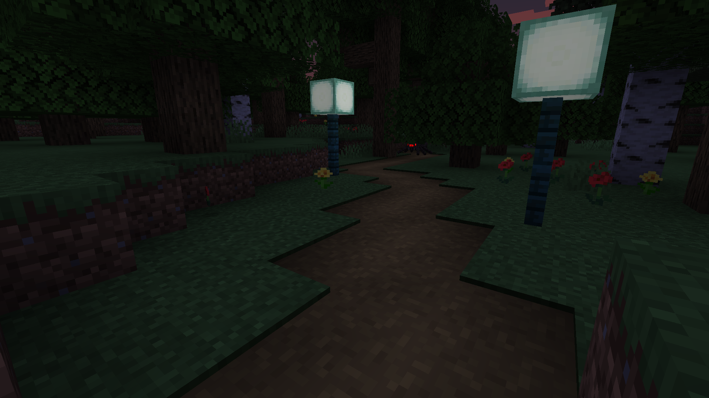
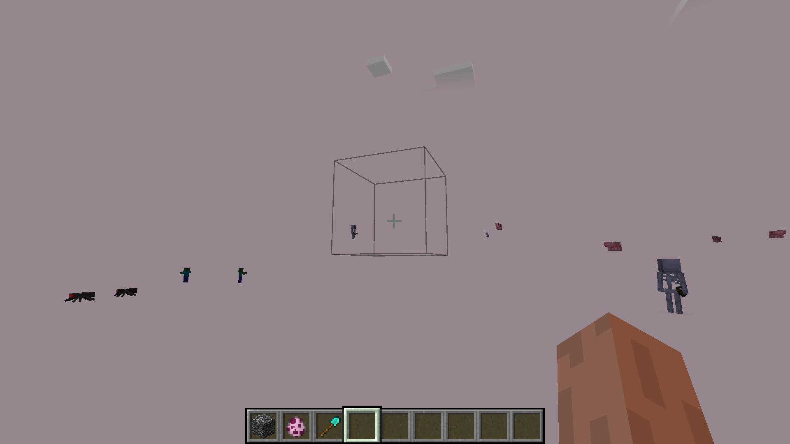

# No Render

A Minecraft Forge mod to toggle rendering of various things

Too many cows? Your game lags? Stop it, use No Render. 
Too many items? Simply don't render them and save your FPS. 
Don't like seeing other players? Don't render them.

## Features

### General

- skip Light Updates (ever wanted to live in darkness?)

### Entities

- hide all Entities
- hide Items
- hide Itemframes
- hide Player

### World

- hide Blocks
- hide BlockEntities
- hide the Sky
- hide TerrainFog (the one in the Nether)
- hide Particles

## Screenshots

")
")
")
